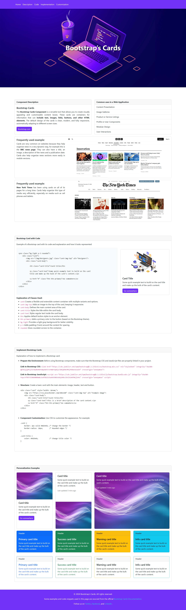

&nbsp;

### Bootstrap’s Cards

This project demonstrates the use of Bootstrap's card component to display content in a clean, modern, and responsive layout. The card is a versatile UI element that can contain images, titles, descriptions, and buttons. In this example, I used the basic Bootstrap card, showing how to create a simple and functional card to organize and present information effectively.

This example includes HTML and CSS customizations to adjust the card's appearance and ensure it fits within the layout of a web page.

### Links
- **GitHub Repository**: [asd](asd)
- **Live Website**: [asd](asd)

